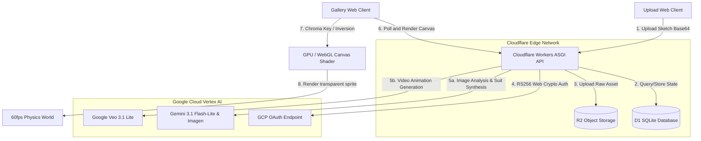

# Paper Spells 🪄 — Bring Hand-Drawn Sketches to Life on the Edge

[](https://fastapi.tiangolo.com)
[](https://workers.cloudflare.com)
[](https://reactjs.org)
[](https://vite.dev)
[](https://pnpm.io)

Paper Spells is an edge-native monorepo project that turns paper doodles, sketches, and characters into interactive animated sprites. The system analyzes the sketch, synthesizes an inline space helmet suit (Imagen), animates it walking (Veo), and drops the animated character into a physics-simulated, multiplayer-ready canvas display.

Built with extreme performance and edge-first constraints in mind, it showcases Python executing in WASM (Pyodide) on Cloudflare Workers, hardware-accelerated client-side chroma keying, and zero-dependency OAuth assertions.

---

## 🏗️ System Architecture

The following diagram illustrates the request lifecycle, decoupling computation on Cloudflare Workers from expensive generative models and client-side processing:



---

## ⚡ Engineering & Architecture Highlights

This codebase is a showcase of advanced serverless and client-side optimizations designed to bypass standard environment limitations:

### 1. Zero-Dependency Web Crypto JWT Signer (`gcp_auth.py`)
Standard Python Google Cloud SDKs rely on `cryptography` (which wraps C extensions) and cannot run inside Cloudflare Workers' Wasm/Pyodide sandbox. 
To achieve seamless OAuth 2.0 assertions, this repo implements a **pure Web Crypto API signer**. It reads the GCP Service Account PEM, imports the PKCS8 DER key via `crypto.subtle.importKey`, and signs RS256 assertions inside the browser-like runtime, achieving high security without heavy dependencies.

### 2. High-Performance GPU-Accelerated Chroma-Keying (`ChromaVideo.tsx`)
Rather than burning serverless resources or CPU cycles doing server-side green screen removal on MP4 videos, the frontend offloads chroma-keying to a **WebGL fragment shader** running directly on the client's GPU. By inverting dark pencil outlines into white neon contours and discarding green screen values on the GPU, it runs 50+ concurrent animated characters at 60 FPS without drop-frames.

### 3. Edge-Native D1 Database Optimization
To comply with Workers subrequest limitations and sqlite concurrency properties, the API decouples long-running status checks (Vertex AI) from the critical path:
* `/api/gallery` executes fast, read-only DB checks.
* A batch `/api/poll` worker updates pending tasks (capped at 5 per loop) and auto-cleans stuck tasks (>15 min) in a single SQLite transaction sweep.

### 4. Background Offscreen Canvas Web Workers
To maintain a jank-free 60fps UI during upload, the image upload pipeline utilizes `OffscreenCanvas` inside a dedicated Web Worker thread to handle image resize, padding, and aspect ratio normalization before uploading to the server.

---

## 📂 Repository Structure

```
paper-spells/
├── apps/
│   ├── api-server/        # Python FastAPI ASGI worker (Cloudflare Workers / D1 / R2)
│   │   ├── app/           # Core API logic, DB Repository, and Vertex AI providers
│   │   ├── tests/         # Pytest suite running against Mock & Local Providers
│   │   └── seed_admin.py  # Interactive CLI tool to generate PBKDF2 hashes for admins
│   ├── gallery-web/       # React 18 / Vite Physics display wall (WebGL Chroma rendering)
│   └── upload-web/        # React 18 / Vite Mobile-optimized sketch capture and upload zone
├── package.json           # Monorepo configuration
└── pnpm-workspace.yaml    # PNPM Monorepo workspaces
```

---

## 🚀 Getting Started

### 1. Installation
Clone the repository and install workspace dependencies:
```bash
git clone https://github.com/yourusername/paper-spells.git
cd paper-spells
pnpm install
```

### 2. Database & Storage Provisioning
Make sure you have `wrangler` CLI logged into your Cloudflare account.

Create the D1 Database and run the schema migration:
```bash
# Create the D1 instance
npx wrangler d1 create paper-spells-db

# Run the local migration (for development)
npx wrangler d1 execute paper-spells-db --local --file=apps/api-server/schema.sql

# Run the remote migration (for production deployment)
npx wrangler d1 execute paper-spells-db --remote --file=apps/api-server/schema.sql
```

Create your R2 storage bucket:
```bash
npx wrangler r2 bucket create paper-spells-media
```

### 3. Seed the Administrator Account
To access the admin rooms dashboard, you must seed an admin credential. Run the interactive seeder:
```bash
cd apps/api-server
python seed_admin.py
```
Copy and execute the output `wrangler d1 execute` command to insert your new admin account into D1.

### 4. Local Configuration
1. **API Server**: Copy `apps/api-server/.env.example` to `apps/api-server/.env` and fill in your details (toggle `AI_PROVIDER=mock` to test without GCP credentials).
2. **Gallery App**: Copy `apps/gallery-web/.env.example` to `apps/gallery-web/.env` and update the base URL variables.
3. **Upload App**: Copy `apps/upload-web/.env.example` to `apps/upload-web/.env` and update the base URL variables.

### 5. Running the Application Locally
Launch the entire monorepo stack (API, Upload web, and Gallery display) in parallel from the root directory:
```bash
pnpm dev:all
```
Your local services will start:
* **API Server**: `http://localhost:8000`
* **Upload Web client**: `http://localhost:5173` (e.g. `http://localhost:5173/?room_id=lobby`)
* **Gallery Display wall**: `http://localhost:5174` (e.g. `http://localhost:5174/?room_id=lobby`)

---

## 🚢 Production Deployment

Deploy the API server to Cloudflare Workers:
```bash
cd apps/api-server
npx wrangler deploy
```

Deploy the frontends to Cloudflare Pages:
```bash
# Upload client
cd apps/upload-web
pnpm build
npx wrangler pages deploy dist --project-name=paper-spells-upload

# Gallery client
cd apps/gallery-web
pnpm build
npx wrangler pages deploy dist --project-name=paper-spells-gallery
```

---

## 🛡️ License

This project is open-source and licensed under the MIT License. Contributions are welcome!
